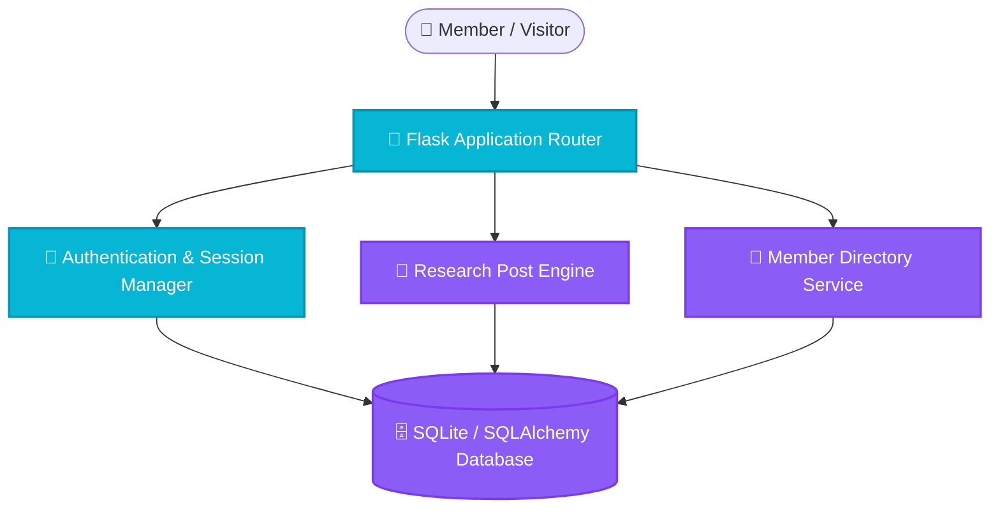

<p align="center">
  
</p>

<h1 align="center">🧪 Laboratory Research Blog & Knowledge Portal</h1>

<p align="center">
  <strong>Full-featured scientific laboratory portal, research blog, and member management system built with Flask and SQLAlchemy.</strong>
</p>

<p align="center">
  <a href="#-features">Features</a> •
  <a href="#-architecture">Architecture</a> •
  <a href="#-quick-start">Quick Start</a> •
  <a href="#-project-structure">Structure</a> •
  <a href="#-license">License</a>
</p>

<p align="center">
     
</p>

---

## ✨ Features (Key Outcomes & Capabilities)

| Icon | Feature | Outcome & Real Proof |
| :---: | :--- | :--- |
| 📝 | **Research Article Publishing** | Rich Markdown scientific publishing with code syntax highlighting and math support |
| 👥 | **Lab Member Directory** | Manage professor, researcher, and student profiles, alumni histories, and publications |
| 🔒 | **Role-Based Authentication** | Secure session authentication, password hashing, and administrative dashboard |
| 🗄️ | **Lightweight SQLite / SQLAlchemy** | Zero-setup relational database architecture with automated migration scripts |

---

## 📊 Architecture & Flow



---

## 📁 Project Structure

```bash
laboratory-blog-flask/
├── 📁 templates/              # Jinja2 HTML templates
├── 📁 static/                 # CSS stylesheets & scripts
├── 📄 app.py                  # Flask application entry point
├── 📄 requirements.txt        # Python dependencies
└── 📄 README.md               # Documentation
```

---

## 🚀 Quick Start

### Prerequisites
- Check language runtimes (Python / Node.js) and system dependencies.

```bash
# 1. Clone repository
git clone https://github.com/LoNebula/Laboratory-blog-flask.git
cd Laboratory-blog-flask

# 2. Install dependencies
pip install -r requirements.txt

# 3. Launch application
python app.py
```

---

## 💡 Usage Notes & Tips

> [!TIP]
> Ensure all required environment variables and dependencies are properly configured before execution.

---

<p align="center">
  Released under the <a href="LICENSE">MIT License</a>. Made with ❤️ by <a href="https://github.com/LoNebula">LoNebula</a>
</p>
