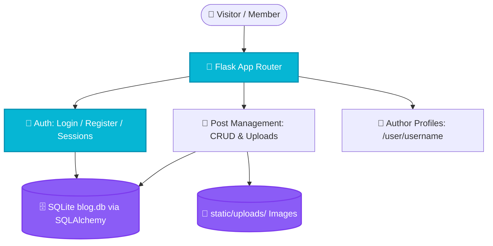

<p align="center">
  
</p>

<h1 align="center">🧪 Laboratory Research Blog & Portal</h1>

<p align="center">
  <strong>Full-Stack Scientific Laboratory Knowledge Portal & Research Blog Built with Flask & SQLAlchemy.</strong>
</p>

<p align="center">
  <a href="#-overview">Overview</a> •
  <a href="#-features">Features</a> •
  <a href="#-code-architecture">Code Architecture</a> •
  <a href="#-system-flow">System Flow</a> •
  <a href="#-project-structure">Structure</a> •
  <a href="#-quick-start">Quick Start</a> •
  <a href="#-license">License</a>
</p>

<p align="center">
     
</p>

---

## 📌 Overview

A full-featured Flask web application serving as an academic laboratory portal and scientific research blog. Provides secure user authentication, role-based member management, rich article publishing with image uploads, author-specific profile pages, and administrative dashboard management.

---

## ✨ Features (Key Outcomes & Capabilities)

| Icon | Feature | Outcome & Real Proof |
| :---: | :--- | :--- |
| 📝 | **Research Article Publishing** | Create, edit, and delete research posts with image attachments |
| 🔐 | **Secure User Authentication** | Password hashing via Werkzeug with session protection |
| 👥 | **Member & Author Portals** | Author-specific article listings (`/user/<username>`) and member profiles |
| 📊 | **Lab Management Dashboard** | Centralized administrative overview for all laboratory posts |

---

## 🔬 Code Architecture & Implementation

### 🔬 Code Implementation (`app.py`)
- **Database Models (`SQLAlchemy`)**:
  - `User`: `id`, `username`, `password_hash` (Werkzeug secure hashing), `role` (Admin/Member).
  - `Post`: `id`, `title`, `content`, `image_filename`, `created_at`, `user_id` (foreign key).
- **Authentication & Security**: Session management with `os.urandom(24)` secret key, password hashing via `generate_password_hash` / `check_password_hash`, and secure filename sanitization (`secure_filename`).
- **File Upload Engine**: Image uploads restricted to `ALLOWED_EXTENSIONS = {'png', 'jpg', 'jpeg', 'gif'}` and served via `static/uploads/`.
- **Templates**: Jinja2 inheritance with `base.html`, `dashboard.html`, `post.html`, and `user_posts.html`.

---

## 📊 System Flow



---

## 📁 Project Structure

```bash
laboratory-blog-flask/
├── 📁 assets/                 # High-resolution SVG banners
│   └── 🎨 hero.svg
├── 📁 templates/              # Jinja2 templates (base, dashboard, post, user_posts)
├── 📁 static/                 # CSS stylesheets, JS scripts & uploads
├── 📄 app.py                  # Flask routes, SQLAlchemy models & auth logic
├── 📄 reset_database.py       # Database initialization & reset utility
├── 📄 requirements.txt        # Flask, Flask-SQLAlchemy, Werkzeug
└── 📄 README.md               # Documentation
```

---

## 🚀 Quick Start

```bash
# 1. Clone repository
git clone https://github.com/LoNebula/Laboratory-blog-flask.git
cd Laboratory-blog-flask

# 2. Install dependencies
pip install -r requirements.txt

# 3. Initialize database
python reset_database.py

# 4. Launch application (http://127.0.0.1:5000)
python app.py
```

---

<p align="center">
  Released under the <a href="LICENSE">MIT License</a>. Crafted with precision by <a href="https://github.com/LoNebula">LoNebula</a>
</p>
